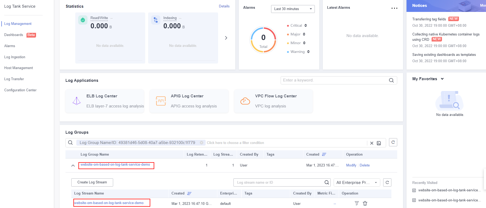
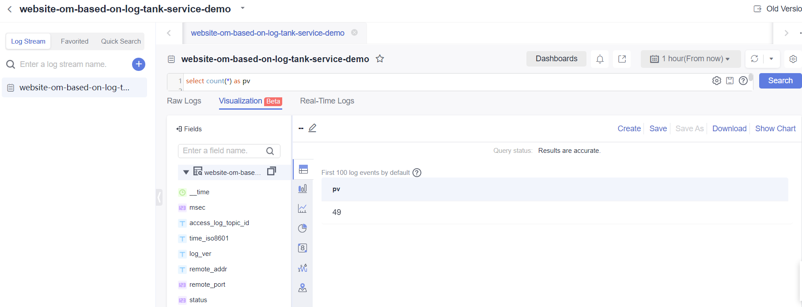

[TOC]

**Solution Overview**
===============
Quickly interconnect Log Tank Service (LTS) with Elastic Load Balance (ELB) and collect ELB logs for routine website O&M analysis. When distributing external traffic, ELB logs details of HTTP and HTTPS requests, such as URIs, client IP addresses and ports, and status codes.

For more details about this solution, visit: https://www.huaweicloud.com/intl/en-us/solution/implementations/womablts.html

**Architecture**
---------------


**Architecture Description**
---------------
This solution will:
- Create an LTS log group and log stream to report ELB access logs to LTS.
- Create an LTS structuring template and configure an ELB system template.


**File Structure**
---------------

``` lua
huaweicloud-solution-website-om-based-on-log-tank-service
├──website-om-based-on-log-tank-service.tf.json -- Resource orchestration template
```
**Getting Started**
---------------

1. Log in to the [ELB console](https://console-intl.huaweicloud.com/vpc/?agencyId=WOmAijZnbElNjCFzTVDl4aJQAgdaTUMD&region=ap-southeast-3&locale=en-us#/elb/list) and click the load balancer for which you want to configure access logs.

	Figure 1 ELB console

	

2. On the **Access Logs** tab, click **Configure Access Logging**. Enable access logging, select an LTS log group and log stream, and click **OK**.

	Figure 2 Configuring access logging

	

	Figure 3 Selecting a created log group and log stream

	

3. Click **View Log Details**. On the LTS console, view the created log group and log stream, and click the created log stream.

	Figure 4 Viewing log details

	

	Figure 5 LTS console

	

4. On the log stream page, click the **Visualization** tab to implement SQL query and analysis.

	Figure 6 Visualization tab

	
- To count the PVs within one hour, run the following SQL statement:
select count(*) as pv

	Figure 7 PVs

	

- To count the UVs within one hour, run the following SQL statement:
select count(distinct remote_port) as uv

	Figure 8 UVs

	

- To count the UVs within one hour, run the following SQL statement:
Statistics on 2xx/3xx/4xx/5xx (return codes) returned by all URIs in one hour are collected to show the service execution result. The SQL query and analysis statements are as follows:

```select host, router_request_uri as url, count(*) as pv,

sum(case when status >= 200 and status < 300 then 1 else 0 end )  as "2xx times",

sum(case when status >= 300 and status < 400 then 1 else 0 end )  as "3xx times",

sum(case when status >= 400 and status < 500 then 1 else 0 end )  as "4xx times",

sum(case when status >= 500 and status < 600 then 1 else 0 end )  as "5xx times"

group by host, router_request_uri 

order by pv desc  

limit 100
```

- You can visualize the results in a table, bar chart, line chart, pie chart, or number chart. The following figure presents the results in a bar chart.

	Figure 9 Response codes

	
